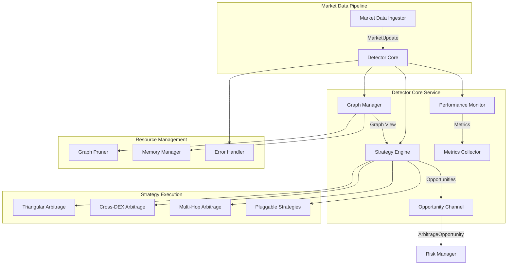

# Detector Enhancement Design Document

## Overview

The detector enhancement transforms the existing arbitrage detection service into a high-performance, production-ready system capable of processing market updates within 50ms while maintaining data integrity and extensibility. The design focuses on parallel processing, intelligent resource management, and comprehensive observability while preserving the existing modular architecture.

The enhanced detector will serve as the critical path component in the arbitrage bot pipeline, processing real-time market data from multiple DEXes and identifying profitable opportunities using sophisticated graph algorithms. Key design principles include zero-allocation hot paths, async-first architecture, and configuration-driven behavior.

## Architecture

### High-Level Architecture



### Component Responsibilities

**Detector Core**: Central orchestrator managing message flow, strategy coordination, and system lifecycle. Implements the main service loop with configurable batch processing and error recovery.

**Graph Manager**: Maintains the price graph with intelligent pruning, memory optimization, and concurrent access patterns. Provides immutable graph views to strategies while handling updates atomically.

**Strategy Engine**: Executes multiple arbitrage detection algorithms in parallel using tokio tasks. Manages strategy lifecycle, configuration updates, and result aggregation.

**Performance Monitor**: Tracks system metrics, latency measurements, and resource usage. Provides real-time observability and alerting capabilities.

## Components and Interfaces

### Core Service Interface

```rust
pub struct DetectorService {
    graph_manager: Arc<GraphManager>,
    strategy_engine: Arc<StrategyEngine>,
    performance_monitor: Arc<PerformanceMonitor>,
    config: Arc<RwLock<DetectorConfig>>,
    opportunity_sender: broadcast::Sender<ArbitrageOpportunity>,
}

impl DetectorService {
    pub async fn process_market_updates(&self, updates: Vec<MarketUpdate>) -> Result<(), DetectorError>;
    pub async fn reload_config(&self, config: DetectorConfig) -> Result<(), DetectorError>;
    pub fn subscribe_opportunities(&self) -> broadcast::Receiver<ArbitrageOpportunity>;
    pub async fn get_health_status(&self) -> HealthStatus;
}
```

**Design Rationale**: The service uses Arc for shared ownership across async tasks, RwLock for configuration updates, and broadcast channels for fan-out opportunity distribution. This enables concurrent processing while maintaining thread safety.

### Graph Manager Interface

```rust
pub struct GraphManager {
    graph: Arc<RwLock<PriceGraph>>,
    pruner: GraphPruner,
    memory_tracker: MemoryTracker,
    update_cache: LruCache<EdgeId, MarketUpdate>,
}

impl GraphManager {
    pub async fn apply_updates(&self, updates: Vec<MarketUpdate>) -> Result<GraphView, DetectorError>;
    pub async fn create_view(&self, strategy_type: StrategyType) -> GraphView;
    pub async fn prune_stale_edges(&self) -> PruningStats;
    pub fn get_memory_usage(&self) -> MemoryStats;
}
```

**Design Rationale**: Separates graph mutations from read operations using immutable views. The LRU cache enables graph reconstruction during error recovery, while the pruner maintains optimal graph size.

### Strategy Engine Interface

```rust
#[async_trait]
pub trait ArbitrageStrategy: Send + Sync {
    async fn detect_opportunities(&self, graph_view: &GraphView) -> Result<Vec<ArbitrageOpportunity>, StrategyError>;
    fn strategy_type(&self) -> StrategyType;
    fn required_graph_features(&self) -> GraphFeatures;
}

pub struct StrategyEngine {
    strategies: HashMap<StrategyType, Box<dyn ArbitrageStrategy>>,
    executor: TaskExecutor,
    config: StrategyConfig,
}
```

**Design Rationale**: The trait-based approach enables pluggable strategies while the TaskExecutor manages parallel execution with proper resource limits and error isolation.

### DEX Adapter Integration Interface

```rust
#[async_trait]
pub trait DexAdapter: Send + Sync {
    async fn get_quote(&self, request: GetQuoteRequest) -> Result<QuoteResult, QuoteError>;
    async fn find_optimal_trade_size(&self, request: OptimalSizeRequest) -> Result<OptimalSizeResult, QuoteError>;
    fn supported_pool_types(&self) -> Vec<PoolType>;
    fn dex_id(&self) -> DexId;
}

pub struct GetQuoteRequest {
    pub pool_address: String,
    pub pool_type: PoolType,
    pub pool_state: PoolState,
    pub input_token: TokenId,
    pub output_token: TokenId,
    pub input_amount: Decimal,
}

pub struct QuoteResult {
    pub output_amount: Decimal,
    pub price_impact: Decimal,
    pub slippage_estimate: Decimal,
    pub gas_estimate: u64,
    pub execution_price: Decimal,
}

pub struct OptimalSizeRequest {
    pub pool_address: String,
    pub pool_type: PoolType,
    pub pool_state: PoolState,
    pub input_token: TokenId,
    pub output_token: TokenId,
    pub max_input_amount: Decimal,
}

pub struct OptimalSizeResult {
    pub optimal_input: Decimal,
    pub expected_output: Decimal,
    pub marginal_price: Decimal,
    pub efficiency_score: f64,
}
```

**Design Rationale**: DEX adapters encapsulate pool-specific business logic while providing a uniform interface. The quote system enables accurate profit calculations with real slippage and price impact considerations.

## Data Models

### Enhanced Graph Structures with DEX Integration

```rust
pub struct PriceGraph {
    edges: HashMap<EdgeId, Edge>,
    adjacency: HashMap<TokenId, Vec<EdgeId>>,
    dex_adapters: Arc<HashMap<DexId, Box<dyn DexAdapter>>>,
    metadata: GraphMetadata,
    last_update: Instant,
}

pub struct Edge {
    pub id: EdgeId,
    pub token0: TokenId,  // Lexicographically smaller token address
    pub token1: TokenId,  // Lexicographically larger token address
    pub dex: DexId,
    pub pool_address: String,
    pub pool_type: PoolType,
    pub pool_state: PoolState,
    pub last_updated: Instant,
    pub update_count: u64,
    pub opportunity_count: u64,
    pub is_protected: bool,
    // Cached price estimates for quick pathfinding
    pub estimated_price_0_to_1: Decimal,  // Rough price for token0 -> token1
    pub estimated_price_1_to_0: Decimal,  // Rough price for token1 -> token0
}

impl Edge {
    /// Get quote for a specific input amount and direction using the appropriate DEX adapter
    pub async fn get_quote(&self, 
                          input_token: TokenId,
                          output_token: TokenId,
                          input_amount: Decimal, 
                          dex_adapters: &HashMap<DexId, Box<dyn DexAdapter>>) 
                          -> Result<QuoteResult, QuoteError> {
        
        // Validate that this edge supports the requested token pair
        if !((input_token == self.token0 && output_token == self.token1) ||
             (input_token == self.token1 && output_token == self.token0)) {
            return Err(QuoteError::InvalidTokenPair { 
                edge_id: self.id, 
                input_token, 
                output_token 
            });
        }
        
        let adapter = dex_adapters.get(&self.dex)
            .ok_or(QuoteError::AdapterNotFound(self.dex))?;
            
        adapter.get_quote(GetQuoteRequest {
            pool_address: self.pool_address.clone(),
            pool_type: self.pool_type,
            pool_state: self.pool_state.clone(),
            input_token,
            output_token,
            input_amount,
        }).await
    }
    
    /// Get estimated price for quick pathfinding without expensive DEX adapter calls
    pub fn get_estimated_price(&self, input_token: TokenId, output_token: TokenId) -> Result<Decimal, QuoteError> {
        if input_token == self.token0 && output_token == self.token1 {
            Ok(self.estimated_price_0_to_1)
        } else if input_token == self.token1 && output_token == self.token0 {
            Ok(self.estimated_price_1_to_0)
        } else {
            Err(QuoteError::InvalidTokenPair { 
                edge_id: self.id, 
                input_token, 
                output_token 
            })
        }
    }
    
    /// Check if this edge connects the given tokens (in either direction)
    pub fn connects_tokens(&self, token_a: TokenId, token_b: TokenId) -> bool {
        (self.token0 == token_a && self.token1 == token_b) ||
        (self.token0 == token_b && self.token1 == token_a)
    }
    
    /// Get the other token in this pair
    pub fn get_other_token(&self, token: TokenId) -> Option<TokenId> {
        if token == self.token0 {
            Some(self.token1)
        } else if token == self.token1 {
            Some(self.token0)
        } else {
            None
        }
    }
}

pub struct PoolState {
    pub reserves: HashMap<TokenId, Decimal>,
    pub fees: FeeStructure,
    pub pool_specific_data: serde_json::Value, // For pool-type specific data
}

#[derive(Clone, Debug)]
pub enum PoolType {
    ConstantProduct,    // x * y = k (Uniswap V2 style)
    StableSwap,        // Curve-style stable pools
    ConcentratedLiquidity, // Uniswap V3 style
    Weighted,          // Balancer-style weighted pools
    Custom(String),    // DEX-specific pool types
}

pub struct GraphView {
    edges: Arc<HashMap<EdgeId, Edge>>,
    adjacency: Arc<HashMap<TokenId, Vec<EdgeId>>>,
    dex_adapters: Arc<HashMap<DexId, Box<dyn DexAdapter>>>,
    created_at: Instant,
    strategy_filter: Option<StrategyFilter>,
}
```

**Design Rationale**: The graph uses separate edge storage and adjacency lists for efficient pathfinding. Edges track metadata for intelligent pruning decisions. Immutable views prevent data races during strategy execution.

### Opportunity Model Extensions

```rust
pub struct ArbitrageOpportunity {
    pub id: OpportunityId,
    pub strategy_type: StrategyType,
    pub path: Vec<EdgeId>,
    pub expected_profit: Decimal,
    pub required_capital: Decimal,
    pub confidence_score: f64,
    pub detected_at: Instant,
    pub expires_at: Instant,
    pub risk_metrics: RiskMetrics,
    pub execution_complexity: ExecutionComplexity,
}

pub struct RiskMetrics {
    pub slippage_estimate: Decimal,
    pub liquidity_depth: Decimal,
    pub price_impact: Decimal,
    pub execution_risk: RiskLevel,
}
```

**Design Rationale**: Enhanced opportunity model includes risk assessment and execution metadata to support downstream risk management and execution planning.

## Opportunity Sizing and Optimization

### Perfect Sizing Algorithm

The detector implements a sophisticated opportunity sizing system that determines the optimal trade size for maximum profit while accounting for slippage, price impact, and liquidity constraints across multi-hop paths.

```rust
pub struct OpportunitySizer {
    dex_adapters: Arc<HashMap<DexId, Box<dyn DexAdapter>>>,
    config: SizingConfig,
}

impl OpportunitySizer {
    /// Find optimal size for a multi-hop arbitrage opportunity
    pub async fn optimize_opportunity_size(&self, 
                                          path: &[EdgeId], 
                                          graph_view: &GraphView,
                                          max_capital: Decimal) 
                                          -> Result<OptimizedOpportunity, SizingError> {
        
        // Binary search for optimal input amount
        let mut low = dec!(0);
        let mut high = max_capital;
        let mut best_profit = dec!(0);
        let mut optimal_size = dec!(0);
        
        while high - low > self.config.precision_threshold {
            let mid = (low + high) / dec!(2);
            
            match self.calculate_path_profit(path, graph_view, mid).await {
                Ok(profit_result) => {
                    if profit_result.net_profit > best_profit {
                        best_profit = profit_result.net_profit;
                        optimal_size = mid;
                        
                        // Continue searching in the direction of increasing profit
                        if profit_result.marginal_profit > dec!(0) {
                            low = mid;
                        } else {
                            high = mid;
                        }
                    } else {
                        high = mid;
                    }
                }
                Err(_) => {
                    // Size too large, reduce upper bound
                    high = mid;
                }
            }
        }
        
        // Validate final opportunity
        let final_result = self.calculate_path_profit(path, graph_view, optimal_size).await?;
        
        Ok(OptimizedOpportunity {
            path: path.to_vec(),
            optimal_input: optimal_size,
            expected_profit: final_result.net_profit,
            execution_steps: final_result.execution_steps,
            risk_assessment: final_result.risk_assessment,
        })
    }
    
    /// Calculate profit for a specific input amount across a path
    async fn calculate_path_profit(&self, 
                                  path: &[EdgeId], 
                                  graph_view: &GraphView, 
                                  input_amount: Decimal) 
                                  -> Result<PathProfitResult, SizingError> {
        
        let mut current_amount = input_amount;
        let mut execution_steps = Vec::new();
        let mut total_gas_cost = 0u64;
        let mut cumulative_slippage = dec!(0);
        
        // Simulate execution through each edge in the path
        for edge_id in path {
            let edge = graph_view.edges.get(edge_id)
                .ok_or(SizingError::EdgeNotFound(*edge_id))?;
            
            let quote_result = edge.get_quote(current_amount, &graph_view.dex_adapters).await?;
            
            execution_steps.push(ExecutionStep {
                edge_id: *edge_id,
                input_amount: current_amount,
                output_amount: quote_result.output_amount,
                price_impact: quote_result.price_impact,
                slippage: quote_result.slippage_estimate,
                gas_cost: quote_result.gas_estimate,
            });
            
            current_amount = quote_result.output_amount;
            total_gas_cost += quote_result.gas_estimate;
            cumulative_slippage += quote_result.slippage_estimate;
        }
        
        // Calculate net profit accounting for gas costs
        let gross_profit = current_amount - input_amount;
        let gas_cost_in_tokens = self.estimate_gas_cost_in_tokens(total_gas_cost).await?;
        let net_profit = gross_profit - gas_cost_in_tokens;
        
        // Calculate marginal profit for optimization
        let marginal_profit = self.calculate_marginal_profit(path, graph_view, input_amount).await?;
        
        Ok(PathProfitResult {
            net_profit,
            gross_profit,
            marginal_profit,
            execution_steps,
            total_gas_cost,
            cumulative_slippage,
            risk_assessment: self.assess_execution_risk(&execution_steps),
        })
    }
    
    /// Calculate marginal profit to determine optimization direction
    async fn calculate_marginal_profit(&self,
                                      path: &[EdgeId],
                                      graph_view: &GraphView,
                                      input_amount: Decimal)
                                      -> Result<Decimal, SizingError> {
        
        let delta = input_amount * self.config.marginal_delta_percent;
        let base_profit = self.calculate_path_profit(path, graph_view, input_amount).await?.net_profit;
        let increased_profit = self.calculate_path_profit(path, graph_view, input_amount + delta).await?.net_profit;
        
        Ok((increased_profit - base_profit) / delta)
    }
}

pub struct OptimizedOpportunity {
    pub path: Vec<EdgeId>,
    pub optimal_input: Decimal,
    pub expected_profit: Decimal,
    pub execution_steps: Vec<ExecutionStep>,
    pub risk_assessment: RiskAssessment,
}

pub struct ExecutionStep {
    pub edge_id: EdgeId,
    pub input_amount: Decimal,
    pub output_amount: Decimal,
    pub price_impact: Decimal,
    pub slippage: Decimal,
    pub gas_cost: u64,
}

pub struct PathProfitResult {
    pub net_profit: Decimal,
    pub gross_profit: Decimal,
    pub marginal_profit: Decimal,
    pub execution_steps: Vec<ExecutionStep>,
    pub total_gas_cost: u64,
    pub cumulative_slippage: Decimal,
    pub risk_assessment: RiskAssessment,
}
```

### Sizing Strategy Integration

Each arbitrage strategy integrates with the opportunity sizer to ensure detected opportunities include optimal sizing:

```rust
impl ArbitrageStrategy for TriangularArbitrageStrategy {
    async fn detect_opportunities(&self, graph_view: &GraphView) -> Result<Vec<ArbitrageOpportunity>, StrategyError> {
        let raw_paths = self.find_triangular_paths(graph_view)?;
        let mut optimized_opportunities = Vec::new();
        
        for path in raw_paths {
            // Quick profitability check before expensive sizing
            if self.quick_profit_estimate(&path, graph_view).await? > self.config.min_profit_threshold {
                
                // Perform detailed sizing optimization
                match self.sizer.optimize_opportunity_size(&path, graph_view, self.config.max_capital).await {
                    Ok(optimized) if optimized.expected_profit > self.config.min_profit_threshold => {
                        optimized_opportunities.push(ArbitrageOpportunity {
                            id: OpportunityId::new(),
                            strategy_type: StrategyType::Triangular,
                            path: optimized.path,
                            expected_profit: optimized.expected_profit,
                            required_capital: optimized.optimal_input,
                            confidence_score: self.calculate_confidence(&optimized),
                            detected_at: Instant::now(),
                            expires_at: Instant::now() + Duration::from_secs(30),
                            risk_metrics: optimized.risk_assessment.into(),
                            execution_complexity: ExecutionComplexity::from_steps(&optimized.execution_steps),
                        });
                    }
                    _ => {} // Skip unprofitable or failed optimizations
                }
            }
        }
        
        Ok(optimized_opportunities)
    }
}
```

**Design Rationale**: The sizing algorithm uses binary search with marginal profit analysis to find the optimal trade size. It accounts for real slippage, price impact, and gas costs by leveraging DEX adapter quotes. The two-phase approach (quick estimate + detailed optimization) balances accuracy with performance requirements.

## Fast Pathfinding with Two-Phase Quote System

### Challenge: Balancing Speed vs. Accuracy

The core challenge is that shortest path algorithms (like Dijkstra or Bellman-Ford) need to quickly evaluate thousands of potential paths, but accurate DEX adapter quotes are expensive (requiring complex pool math calculations). The solution is a two-phase approach:

**Phase 1: Fast Path Discovery** - Use cached estimated prices for rapid pathfinding
**Phase 2: Accurate Validation** - Use DEX adapter quotes only for promising paths

### Fast Pathfinding Implementation

```rust
impl GraphView {
    /// Fast pathfinding using estimated prices for initial discovery
    pub fn find_potential_arbitrage_paths(&self, 
                                         start_token: TokenId, 
                                         max_hops: usize) -> Vec<Vec<EdgeId>> {
        let mut paths = Vec::new();
        let mut visited = HashSet::new();
        let mut current_path = Vec::new();
        
        self.dfs_paths_with_estimates(
            start_token, 
            start_token, // Target: return to start token
            &mut current_path, 
            &mut visited, 
            &mut paths, 
            max_hops,
            dec!(1.0) // Start with 1 unit for estimation
        );
        
        // Filter paths that show potential profit using estimated prices
        paths.into_iter()
            .filter(|path| self.estimate_path_profit(path, dec!(1.0)) > dec!(0))
            .collect()
    }
    
    /// Quick profit estimation using cached prices (no DEX adapter calls)
    fn estimate_path_profit(&self, path: &[EdgeId], input_amount: Decimal) -> Decimal {
        let mut current_amount = input_amount;
        
        for (i, &edge_id) in path.iter().enumerate() {
            let edge = match self.edges.get(&edge_id) {
                Some(e) => e,
                None => return dec!(-1.0), // Invalid path
            };
            
            // Determine input/output tokens for this hop
            let (input_token, output_token) = if i == 0 {
                // First hop: determine direction based on path context
                self.determine_hop_direction(edge, path, i)
            } else {
                // Subsequent hops: output of previous becomes input of current
                self.determine_hop_direction(edge, path, i)
            };
            
            // Use cached estimated price (fast, no DEX adapter call)
            match edge.get_estimated_price(input_token, output_token) {
                Ok(estimated_price) => {
                    current_amount = current_amount * estimated_price;
                }
                Err(_) => return dec!(-1.0), // Invalid direction
            }
        }
        
        current_amount - input_amount // Gross profit estimate
    }
    
    /// Determine the token flow direction for a hop in the path
    fn determine_hop_direction(&self, edge: &Edge, path: &[EdgeId], hop_index: usize) -> (TokenId, TokenId) {
        if hop_index == 0 {
            // First hop: need to determine starting direction
            // Look ahead to next hop to determine which token to produce
            if let Some(&next_edge_id) = path.get(1) {
                if let Some(next_edge) = self.edges.get(&next_edge_id) {
                    // Find common token between current and next edge
                    if edge.token0 == next_edge.token0 || edge.token0 == next_edge.token1 {
                        (edge.token1, edge.token0) // Produce token0 for next hop
                    } else {
                        (edge.token0, edge.token1) // Produce token1 for next hop
                    }
                } else {
                    (edge.token0, edge.token1) // Default direction
                }
            } else {
                (edge.token0, edge.token1) // Single hop, default direction
            }
        } else {
            // Subsequent hops: input token is the output from previous hop
            let prev_edge_id = path[hop_index - 1];
            if let Some(prev_edge) = self.edges.get(&prev_edge_id) {
                let prev_output = self.get_previous_hop_output(prev_edge, path, hop_index - 1);
                (prev_output, edge.get_other_token(prev_output).unwrap_or(edge.token1))
            } else {
                (edge.token0, edge.token1) // Fallback
            }
        }
    }
}
```

### Strategy Integration with Two-Phase System

```rust
impl ArbitrageStrategy for TriangularArbitrageStrategy {
    async fn detect_opportunities(&self, graph_view: &GraphView) -> Result<Vec<ArbitrageOpportunity>, StrategyError> {
        // Phase 1: Fast discovery using estimated prices
        let potential_paths = graph_view.find_potential_arbitrage_paths(
            self.config.base_token, 
            3 // Triangular = 3 hops
        );
        
        let mut validated_opportunities = Vec::new();
        
        // Phase 2: Validate promising paths with accurate DEX quotes
        for path in potential_paths.into_iter().take(self.config.max_paths_to_validate) {
            // Quick filter: only validate paths with estimated profit > threshold
            let estimated_profit = graph_view.estimate_path_profit(&path, self.config.test_amount);
            if estimated_profit < self.config.min_estimated_profit {
                continue;
            }
            
            // Expensive validation with real DEX adapter quotes
            match self.sizer.optimize_opportunity_size(&path, graph_view, self.config.max_capital).await {
                Ok(optimized) if optimized.expected_profit > self.config.min_actual_profit => {
                    validated_opportunities.push(ArbitrageOpportunity {
                        id: OpportunityId::new(),
                        strategy_type: StrategyType::Triangular,
                        path: optimized.path,
                        expected_profit: optimized.expected_profit,
                        required_capital: optimized.optimal_input,
                        confidence_score: self.calculate_confidence(&optimized),
                        detected_at: Instant::now(),
                        expires_at: Instant::now() + Duration::from_secs(30),
                        risk_metrics: optimized.risk_assessment.into(),
                        execution_complexity: ExecutionComplexity::from_steps(&optimized.execution_steps),
                    });
                }
                _ => {} // Skip unprofitable opportunities
            }
        }
        
        Ok(validated_opportunities)
    }
}
```

### Price Estimation Update Strategy

```rust
impl GraphManager {
    /// Update cached price estimates when market updates arrive
    pub async fn update_price_estimates(&self, updates: &[MarketUpdate]) -> Result<(), DetectorError> {
        let mut graph = self.graph.write().await;
        
        for update in updates {
            if let Some(edge) = graph.edges.get_mut(&update.edge_id) {
                // Update pool state first
                edge.pool_state = update.new_pool_state.clone();
                edge.last_updated = Instant::now();
                
                // Update cached price estimates using simple heuristics
                match edge.pool_type {
                    PoolType::ConstantProduct => {
                        // For x*y=k pools, price = reserve_y / reserve_x
                        if let (Some(&reserve0), Some(&reserve1)) = (
                            edge.pool_state.reserves.get(&edge.token0),
                            edge.pool_state.reserves.get(&edge.token1)
                        ) {
                            edge.estimated_price_0_to_1 = reserve1 / reserve0;
                            edge.estimated_price_1_to_0 = reserve0 / reserve1;
                        }
                    }
                    PoolType::StableSwap => {
                        // For stable pools, use more sophisticated estimation
                        // This is a simplified version - real implementation would be more complex
                        if let (Some(&reserve0), Some(&reserve1)) = (
                            edge.pool_state.reserves.get(&edge.token0),
                            edge.pool_state.reserves.get(&edge.token1)
                        ) {
                            let ratio = reserve1 / reserve0;
                            // Stable pools have prices closer to 1:1, adjust accordingly
                            edge.estimated_price_0_to_1 = ratio * dec!(0.999); // Account for stable curve
                            edge.estimated_price_1_to_0 = (dec!(1) / ratio) * dec!(0.999);
                        }
                    }
                    _ => {
                        // For other pool types, fall back to simple ratio or use DEX adapter
                        // In production, this would call the DEX adapter for a small test amount
                    }
                }
            }
        }
        
        Ok(())
    }
}
```

**Design Rationale**: This two-phase approach solves the speed vs. accuracy dilemma by using fast cached estimates for path discovery and expensive accurate quotes only for validation. The cached estimates are updated with simple heuristics that are "good enough" for filtering, while the DEX adapters provide precise quotes for final opportunity sizing. This keeps the critical path fast while maintaining accuracy for actual trading decisions.

## Error Handling

### Error Hierarchy

```rust
#[derive(thiserror::Error, Debug)]
pub enum DetectorError {
    #[error("Graph operation failed: {source}")]
    GraphError { source: GraphError },
    
    #[error("Strategy execution failed: {strategy} - {source}")]
    StrategyError { strategy: StrategyType, source: StrategyError },
    
    #[error("Performance threshold exceeded: {metric} = {value}ms (limit: {limit}ms)")]
    PerformanceError { metric: String, value: u64, limit: u64 },
    
    #[error("Memory limit exceeded: {usage}MB (limit: {limit}MB)")]
    MemoryError { usage: u64, limit: u64 },
    
    #[error("Configuration error: {message}")]
    ConfigError { message: String },
}
```

### Recovery Strategies

**Graph Corruption Recovery**: When graph inconsistencies are detected, the system rebuilds from the update cache, ensuring minimal data loss while maintaining service availability.

**Strategy Failure Isolation**: Individual strategy failures don't affect other strategies or the core service. Failed strategies are temporarily disabled with exponential backoff retry logic.

**Memory Pressure Handling**: Circuit breakers trigger emergency pruning when memory usage exceeds thresholds, prioritizing system stability over opportunity detection completeness.

**Channel Overflow Management**: When opportunity channels fill up, the system drops oldest opportunities while maintaining metrics about lost opportunities for monitoring.

## Testing Strategy

### Unit Testing Approach

**Strategy Testing**: Each strategy implementation includes comprehensive unit tests with synthetic graph data covering edge cases, performance boundaries, and error conditions.

**Graph Operations**: Graph manager operations are tested with property-based testing to verify invariants under concurrent access patterns.

**Performance Testing**: Latency requirements are validated using criterion benchmarks with realistic market data volumes.

### Integration Testing

**End-to-End Flow**: Integration tests verify complete message flow from market updates to opportunity detection using recorded mainnet data.

**Concurrent Access**: Multi-threaded tests validate thread safety and performance under concurrent strategy execution.

**Error Recovery**: Chaos engineering tests inject failures at various points to verify recovery mechanisms.

### Performance Validation

**Latency Benchmarks**: Automated benchmarks ensure processing stays within 50ms bounds across different graph sizes and update volumes.

**Memory Profiling**: Continuous memory usage monitoring prevents memory leaks and validates pruning effectiveness.

**Load Testing**: Stress tests with high-frequency market updates validate system behavior under extreme conditions.

## Configuration Schema

```yaml
detector:
  performance:
    max_processing_time_ms: 50
    warning_threshold_ms: 80
    max_memory_mb: 2048
    
  graph:
    max_edges: 10000
    stale_edge_timeout_minutes: 5
    protected_pairs: ["APT/USDC", "USDC/USDT"]  # Always use lexicographic order (smaller address first)
    pruning_interval_seconds: 30
    
  strategies:
    triangular:
      enabled: true
      max_path_length: 3
      min_profit_threshold: "0.001"
      
    cross_dex:
      enabled: true
      max_concurrent_comparisons: 100
      
    multi_hop:
      enabled: true
      max_path_length: 7
      exploration_depth: 3
      
  monitoring:
    metrics_interval_seconds: 10
    log_level: "info"
    enable_performance_tracing: true
```

**Design Rationale**: Configuration is hierarchically organized with environment-specific overrides. Hot-reloading is supported for non-structural changes, enabling runtime tuning without service restart.