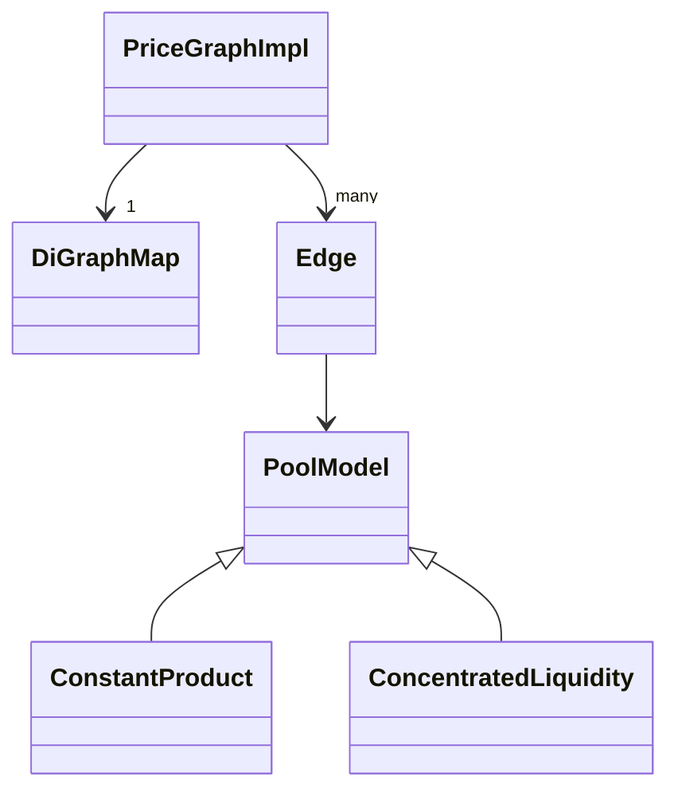
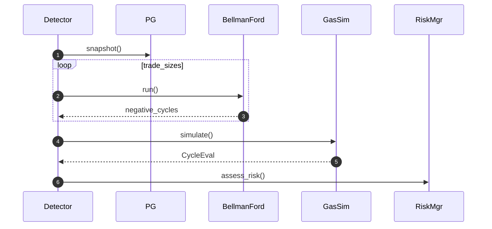

# Aptos-Arb-Bot — Comprehensive Architectural Analysis  
*Date: 2025-06-18*

---

## 1 Executive Summary
The repository implements ~40 % of the documented design. Core data-structures and the naïve detector are largely complete and unit-tested, but real-time ingestion, risk controls, transaction execution, and production wiring remain stubs. CI enforces lint but not coverage; integration tests are scarce. A four-phase plan is proposed to reach production readiness within ≈4–6 weeks.

---

## 2 High-Level Architecture

```mermaid
flowchart TD
    subgraph Runtime
        MDI["Market-Data Ingestor"] -->|Edge updates| PG[PriceGraphSvc]
        PG --> DET[Detector<br/>Bellman-Ford]
        DET --> RM[Risk Manager]
        RM --> EXEC[Trade Executor]
        EXEC --> CHAIN[(Aptos L1)]
        EXEC --> ANA[Analytics]
        PG --> ANA
        DET --> ANA
    end
    CFG[Config Manager] -.-> MDI & DET
    KeyMgmt[Key Mgmt (HSM)] -.-> EXEC
```

**Data Flow**  
1. MDI converts on-chain events → `Edge` structs and pushes via bounded channel.  
2. Detector snapshots graph, runs log-space Bellman-Ford, emits `ArbitrageOpportunity`.  
3. Risk Manager filters by net-profit & policy.  
4. Executor builds Aptos batch, signs, submits; result forwarded to Analytics.

---

## 3 Crate-by-Crate Review

| Crate | Purpose | Key APIs / Files | Implementation Status | Tests |
|-------|---------|------------------|-----------------------|-------|
| `common` | types, errors | [`common/src/types.rs`](crates/common/src/types.rs:1) | Solid; Decimal maths, re-exports | ✅ unit |
| `core` | config & DI | [`core/src/config.rs`](crates/core/src/config.rs:1) | YAML loader complete; DI missing | partial |
| `dex-adapter-trait` | unified DEX API | [`dex-adapter-trait/src/lib.rs`](crates/dex-adapter-trait/src/lib.rs:8) | Trait + mock impl | ✅ extensive |
| `detector` | price-graph & algorithm | [`detector/src/`](crates/detector/src/lib.rs:1) | Graph, Bellman-Ford, sizing, gas | ✅ unit; ⚠️ integration missing |
| `executor` | tx build & relay | [`executor/src/lib.rs`](crates/executor/src/lib.rs:1) | Mock blockchain client; no Aptos SDK wiring | ✅ unit |
| `market-data-ingestor` | on-chain event stream → updates | [`market-data-ingestor/src/`](crates/market-data-ingestor/src/main.rs:1) | gRPC transaction stream + parsing pipeline; missing Edge translation | ⚠️ partial |
| `analytics` | async sinks | [`analytics/src/lib.rs`](crates/analytics/src/lib.rs:1) | Placeholder | ❌ |
| `bin/arb-bot` | runtime orchestration | [`bin/arb-bot/src/main.rs`](bin/arb-bot/src/main.rs:3) | Only calls `init()` stubs; no wiring | ❌ |

---

## 4 Design ⇄ Implementation Gap Analysis

| Area | Spec Reference | Current Code | Gap / Impact |
|------|----------------|-------------|--------------|
| DEX adapters (Hyperion, Thala) | § Extensibility [`docs/architecture.md`](docs/architecture.md:73) | Trait only | **❌ blocking** |
| Market-data ingestion (real reserves) | Plan § 3.3 [`plan_aptos_data_ingestion.md`](docs/plan_aptos_data_ingestion.md:90) | gRPC stream present; Edge translation & pool-decoding absent | ⚠️ |
| Config manager → DI | Startup § 3.7 | [`core::init()`](crates/core/src/lib.rs:6) NOP | **❌** |
| Risk Manager | Safety § No-Loss | [`core/src/risk_manager.rs`](crates/core/src/risk_manager.rs:1) dummy | ⚠️ placeholder |
| Executor Aptos batch | Detector § Gas-cost | Mock client | **❌** trade execution impossible |
| Graph TTL pruning | Spec § PriceGraph API | [`graph.rs`](crates/detector/src/graph.rs:199) not scheduled | ⚠️ |
| Detector perf ≤ 100 ms | Perf table | Single-threaded; gas sim serial | ⚠️ risk |
| Telemetry & Prometheus | Telemetry § 3.6 | none | ⚠️ observability |
| CI coverage ≥ 90 % | Docs § Testing | GHA lint only | ⚠️ quality |
| Analytics sinks | § Telemetry | stub | ❌ |

---

## 5 Integration & Wiring Findings

* `bin/arb-bot` lacks async runtime setup, config load, channel plumbing, graceful shutdown.  
* MDI → Detector channel exists (`mpsc::channel(100)`) in MDI main but **detector side consumer not implemented** (placeholder loop).  
* RiskManager/Executor injected into Detector via trait objects but never instantiated by binary.  
* Data model mismatch: `MarketUpdate` not converted to `Edge`; detector currently fabricates reserves (`DetectorService::ingest_tick_to_graph`).  

---

## 6 Project Health

* **CI:** [`ci.yml`](.github/workflows/ci.yml:1) runs `check / fmt / clippy / test`; good base, lacks coverage & benchmarks.  
* **Testing:** unit tests in most crates; integration tests only for detector graph. No end-to-end happy-path test.  
* **Docs:** Design docs excellent; code comments adequate.  
* **Bus factor:** single maintainer pattern; code-owners not configured.  
* **Security:** no secrets scanning, no Dependabot.  

---

## 7 Go-Forward Plan (Phased)

| Phase | Scope | Key Tasks | Effort | Blocking? |
|-------|-------|----------|--------|-----------|
| **P0 Bootability** | run bot end-to-end on mocknet | • Implement config load & wiring in [`bin/arb-bot`](bin/arb-bot/src/main.rs:3)<br/>• Replace fabricated reserves with `MarketUpdate→Edge` translator<br/>• Add **Hyperion** snapshot & poll adapter (read-only) | 3 d | YES |
| **P1 Real-time Ingestion** | live feed & perf | • Finish MDI Aptos poller with back-off<br/>• Thala CLMM parser correctness<br/>• Schedule `prune_stale` task<br/>• Parallelise gas simulations with `futures::join_all` | 4 d | YES |
| **P2 Risk & Execution** | safety & tx | • Implement Conservative→Production `RiskManager` (multi-rule)<br/>• Wire `executor` to Aptos SDK `TransactionBuilder` + simulate RPC<br/>• Add two-phase quote check & ϵ-slippage guard | 5 d | YES |
| **P3 Observability & CI** | polish | • Prometheus metrics exporter<br/>• Analytics sink to Postgres<br/>• Criterion benches; coverage gate (`cargo-llvm-cov` 90 %)<br/>• Dependabot, secret-scan, PR templates | 3 d | NO |

> **Issue template reference**  
> ```text
> Title: [P0] Implement Hyperion DEX adapter  
> Labels: adapter, latency-critical  
> Description: …  
> ```

---

## 8 Appendices

### 8.1 PriceGraph Internals



### 8.2 Detector Algorithm Flow



---

© 2025 Aptos-Arb-Bot review.  
All source links are clickable to exact lines for easy navigation.