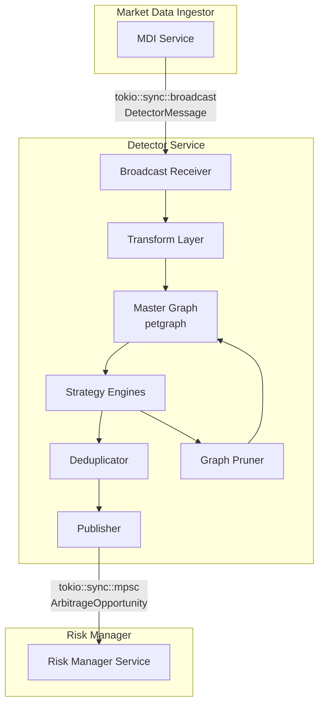
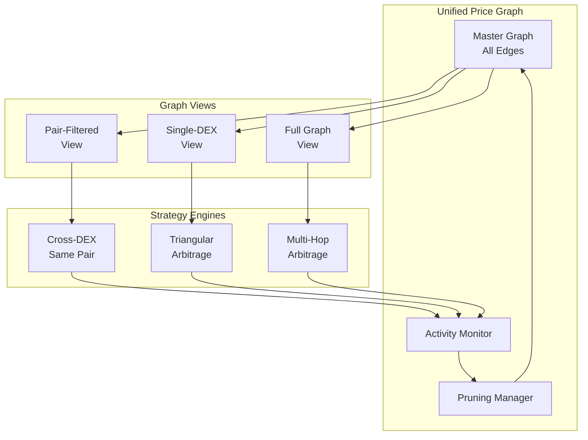
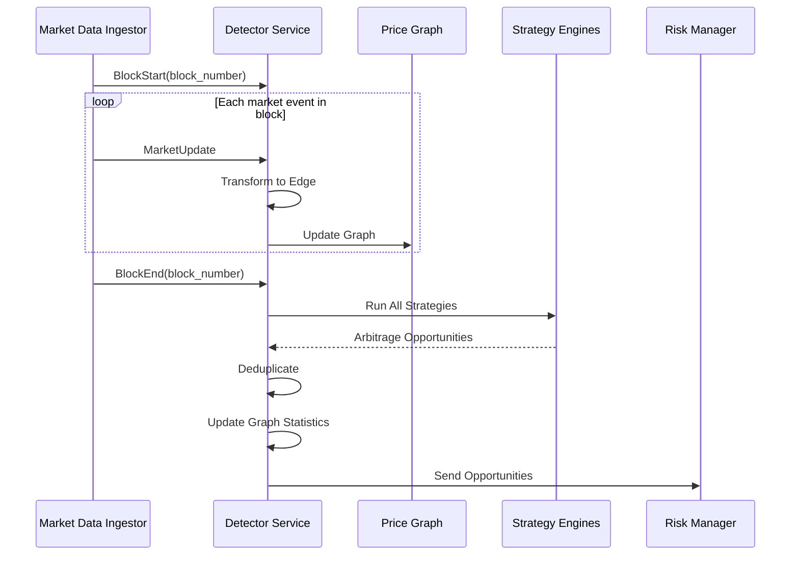

# Detector Service Architecture

## Overview

This document outlines the architecture for refactoring the existing `detector` crate into a modern, asynchronous service that fits into the arbitrage bot pipeline. The detector service is responsible for ingesting market updates, maintaining a price graph, detecting arbitrage opportunities, and publishing them to downstream services.

## Context & Application Flow

The detector service sits in the middle of the arbitrage pipeline:

1. **Market Data Ingestor (MDI):** Produces `MarketUpdate` events
2. **Detector (This Service):** Ingests `MarketUpdate`s, finds arbitrage opportunities
3. **Risk Manager:** Ingests opportunities, checks them against risk profiles
4. **Executor:** Ingests approved opportunities and executes trades

## Architecture Overview

### Service Architecture



### Multi-Strategy Architecture

The detector supports multiple arbitrage strategies operating on a unified price graph:



## Block-Aligned Detection

Detection runs are synchronized with Aptos blocks (currently ~130ms):



## Data Structures

### Common Types (in `common-types` crate)

```rust
// Message types for block-aligned processing
pub enum DetectorMessage {
    BlockStart { 
        block_number: u64, 
        timestamp: u64 
    },
    MarketUpdate(MarketUpdate),
    BlockEnd { 
        block_number: u64 
    },
}

// Market update from MDI
pub struct MarketUpdate {
    pub pool_address: String,
    pub dex_name: String,
    pub token_pair: TokenPair,
    pub sqrt_price: u128,
    pub liquidity: u128,
    pub tick: u32,
    pub fee_bps: u32,
    pub tick_map: HashMap<i32, TickInfo>,
}

// Internal edge representation
pub struct Edge {
    pub from_token: String,
    pub to_token: String,
    pub pool_address: String,
    pub dex_name: String,
    pub liquidity: Decimal,
    pub fee_bps: u32,
    pub last_updated: Instant,
    // Statistics for pruning
    pub last_opportunity: Option<Instant>,
    pub opportunity_count: u32,
    pub total_volume: Decimal,
}

// Output to risk manager
pub struct ArbitrageOpportunity {
    pub id: Uuid,
    pub strategy: String,
    pub path: Vec<Edge>,
    pub expected_profit: Decimal,
    pub input_amount: Decimal,
    pub gas_estimate: u64,
    pub block_number: u64,
    pub timestamp: Instant,
}
```

### Graph Management

```rust
pub struct PriceGraph {
    // Main graph with -log(price) weights
    graph: Graph<TokenNode, f64, Directed>,
    
    // Fast lookups
    node_indices: HashMap<String, NodeIndex>,
    edge_metadata: HashMap<(NodeIndex, NodeIndex), EdgeMetadata>,
    
    // Activity tracking for pruning
    edge_activity: HashMap<EdgeId, ActivityStats>,
    
    // Configuration
    pruning_config: PruningConfig,
}

pub struct ActivityStats {
    pub last_update: Instant,
    pub last_opportunity: Option<Instant>,
    pub opportunity_count: u32,
    pub total_volume: Decimal,
    pub tvl: Decimal,
}

pub struct PruningConfig {
    // Keep edges involved in opportunities within this window
    pub opportunity_window: Duration, // e.g., 1 hour
    
    // Minimum TVL to keep edge active
    pub min_tvl: Decimal, // e.g., $1000
    
    // Maximum age for edges with no opportunities
    pub max_stale_age: Duration, // e.g., 5 minutes
    
    // Edges to always keep (high-value pairs)
    pub protected_pairs: Vec<(String, String)>,
}
```

### Strategy System

```rust
// Strategy trait for different arbitrage types
#[async_trait]
pub trait ArbitrageStrategy: Send + Sync {
    fn name(&self) -> &str;
    fn required_graph_view(&self) -> GraphView;
    async fn detect_opportunities(
        &self,
        graph: &PriceGraphView,
        block_number: u64,
    ) -> Result<Vec<ArbitrageOpportunity>>;
}

pub enum GraphView {
    // For cross-DEX same pair
    PairFiltered { pairs: Vec<(String, String)> },
    
    // For triangular arb on single DEX
    SingleDex { dex_name: String },
    
    // For complex multi-hop
    FullGraph,
    
    // Custom filter
    Custom(Box<dyn Fn(&Edge) -> bool + Send + Sync>),
}

// Example implementations
pub struct CrossDexArbitrage {
    monitored_pairs: Vec<(String, String)>,
    min_price_diff_pct: f64,
}

pub struct TriangularArbitrage {
    max_path_length: usize,
    target_dex: Option<String>,
}

pub struct MultiHopArbitrage {
    max_hops: usize,
    min_liquidity: Decimal,
    enable_cross_dex: bool,
}
```

## Graph Pruning Strategy

The graph maintains all edges but intelligently prunes based on:

1. **Opportunity Tracking**: Edges involved in profitable opportunities are prioritized
2. **TVL Threshold**: Low-liquidity edges are pruned unless recently profitable
3. **Staleness**: Edges not updated recently are moved to inactive status

```rust
impl PriceGraph {
    pub fn prune(&mut self) -> PruneStats {
        let now = Instant::now();
        let mut pruned = 0;
        let mut retained = 0;
        
        for (edge_id, stats) in &self.edge_activity {
            let should_keep = 
                // Recently found opportunity
                stats.last_opportunity
                    .map(|t| now.duration_since(t) < self.pruning_config.opportunity_window)
                    .unwrap_or(false)
                ||
                // High TVL
                stats.tvl >= self.pruning_config.min_tvl
                ||
                // Protected pair
                self.is_protected_pair(edge_id)
                ||
                // Recently updated
                now.duration_since(stats.last_update) < Duration::from_secs(30);
            
            if should_keep {
                retained += 1;
            } else {
                self.mark_inactive(edge_id);
                pruned += 1;
            }
        }
        
        PruneStats { pruned, retained }
    }
}
```

## Service Implementation

```rust
pub struct DetectorService {
    // Channels
    receiver: broadcast::Receiver<DetectorMessage>,
    opportunity_sender: mpsc::Sender<ArbitrageOpportunity>,
    
    // State
    price_graph: PriceGraph,
    strategies: Vec<Box<dyn ArbitrageStrategy>>,
    deduplicator: OpportunityDeduplicator,
    
    // Metrics
    metrics: DetectorMetrics,
    
    // Current block state
    current_block: Option<u64>,
    block_updates: Vec<MarketUpdate>,
}

#[derive(Debug, Clone, Copy)]
enum DetectorState {
    Waiting,      // Waiting for next block
    InProgress,   // Processing block updates
}

impl DetectorService {
    pub async fn run(mut self) -> Result<()> {
        let mut state = DetectorState::Waiting;
        
        loop {
            match self.receiver.recv().await? {
                DetectorMessage::BlockStart { block_number, timestamp } => {
                    // New block started - transition to InProgress
                    state = DetectorState::InProgress;
                    self.current_block = Some(block_number);
                    self.block_updates.clear();
                    
                    debug!("Block {} started at {}", block_number, timestamp);
                }
                
                DetectorMessage::MarketUpdate(update) => {
                    // Only process updates if we're in the right state
                    match state {
                        DetectorState::InProgress => {
                            // Transform and update graph immediately
                            if let Ok(edge) = self.transform_update(update) {
                                self.price_graph.update_edge(edge);
                                self.block_updates.push(update);
                            }
                        }
                        DetectorState::Waiting => {
                            warn!("Received MarketUpdate while waiting for BlockStart");
                        }
                    }
                }
                
                DetectorMessage::BlockEnd { block_number } => {
                    // Block complete - run detection and transition back to Waiting
                    match state {
                        DetectorState::InProgress => {
                            // Run detection on block completion
                            let start = Instant::now();
                            let opportunities = self.detect_all_strategies(block_number).await?;
                            let detection_time = start.elapsed();
                            
                            // Update graph statistics based on opportunities found
                            self.update_opportunity_stats(&opportunities);
                            
                            // Deduplicate and send
                            for opp in opportunities {
                                if self.deduplicator.should_publish(&opp) {
                                    self.opportunity_sender.send(opp).await?;
                                }
                            }
                            
                            // Periodic pruning (every N blocks)
                            if block_number % 100 == 0 {
                                let stats = self.price_graph.prune();
                                info!("Pruned {} edges, retained {}", stats.pruned, stats.retained);
                            }
                            
                            // Log performance - we should complete before next block
                            if detection_time.as_millis() > 100 {
                                warn!("Detection took {}ms for block {} - may miss next block!",
                                      detection_time.as_millis(), block_number);
                            }
                            
                            // Transition back to waiting
                            state = DetectorState::Waiting;
                        }
                        DetectorState::Waiting => {
                            warn!("Received BlockEnd while already waiting");
                        }
                    }
                }
            }
        }
    }
    
    async fn detect_all_strategies(&self, block_number: u64) -> Result<Vec<ArbitrageOpportunity>> {
        let mut all_opportunities = Vec::new();
        
        // Run strategies in parallel
        let mut handles = Vec::new();
        
        for strategy in &self.strategies {
            let graph_view = self.price_graph.create_view(strategy.required_graph_view());
            let strategy = strategy.clone();
            let handle = tokio::spawn(async move {
                strategy.detect_opportunities(&graph_view, block_number).await
            });
            handles.push(handle);
        }
        
        // Collect results
        for handle in handles {
            if let Ok(Ok(opportunities)) = handle.await {
                all_opportunities.extend(opportunities);
            }
        }
        
        Ok(all_opportunities)
    }
}
```

## Strategy Implementation & File Structure

### File Organization

```
crates/detector/src/
├── lib.rs                 # Public API
├── service.rs             # Main service loop
├── transform.rs           # MarketUpdate → Edge transformation
├── graph/
│   ├── mod.rs
│   ├── state.rs          # Graph state management
│   └── edge_weight.rs    # -log(price) calculations
├── strategies/           # Strategy implementations
│   ├── mod.rs           # Strategy registry and factory
│   ├── cross_dex.rs     # Cross-DEX same pair arbitrage
│   ├── triangular.rs    # Triangular arbitrage
│   └── multi_hop.rs     # Multi-hop arbitrage
├── algorithm/
│   ├── mod.rs
│   └── bellman_ford.rs  # Core path-finding algorithm
└── config.rs            # Service configuration
```

### Strategy Registry

The `type` field in the configuration maps to specific strategy implementations through a registry pattern:

```rust
// In strategies/mod.rs
use std::collections::HashMap;
use once_cell::sync::Lazy;

pub mod cross_dex;
pub mod triangular;
pub mod multi_hop;

type StrategyFactory = Box<dyn Fn(serde_json::Value) -> Result<Box<dyn ArbitrageStrategy>> + Send + Sync>;

static STRATEGY_REGISTRY: Lazy<HashMap<&'static str, StrategyFactory>> = Lazy::new(|| {
    let mut registry = HashMap::new();
    
    // Register built-in strategies
    registry.insert("cross_dex_same_pair", Box::new(|config| {
        let strategy_config: cross_dex::CrossDexConfig = serde_json::from_value(config)?;
        Ok(Box::new(cross_dex::CrossDexArbitrage::new(strategy_config)))
    }) as StrategyFactory);
    
    registry.insert("triangular_arbitrage", Box::new(|config| {
        let strategy_config: triangular::TriangularConfig = serde_json::from_value(config)?;
        Ok(Box::new(triangular::TriangularArbitrage::new(strategy_config)))
    }) as StrategyFactory);
    
    registry.insert("multi_hop", Box::new(|config| {
        let strategy_config: multi_hop::MultiHopConfig = serde_json::from_value(config)?;
        Ok(Box::new(multi_hop::MultiHopArbitrage::new(strategy_config)))
    }) as StrategyFactory);
    
    registry
});

pub fn create_strategy(strategy_type: &str, config: serde_json::Value) -> Result<Box<dyn ArbitrageStrategy>> {
    STRATEGY_REGISTRY
        .get(strategy_type)
        .ok_or_else(|| anyhow!("Unknown strategy type: {}", strategy_type))?
        (config)
}
```

### Example Strategy Implementation

Each strategy file contains its configuration struct and implementation:

```rust
// In strategies/cross_dex.rs
use crate::strategies::ArbitrageStrategy;
use serde::Deserialize;

#[derive(Debug, Deserialize)]
pub struct CrossDexConfig {
    pub pairs: Vec<(String, String)>,
    pub min_price_diff_pct: f64,
}

pub struct CrossDexArbitrage {
    config: CrossDexConfig,
}

impl CrossDexArbitrage {
    pub fn new(config: CrossDexConfig) -> Self {
        Self { config }
    }
}

#[async_trait]
impl ArbitrageStrategy for CrossDexArbitrage {
    fn name(&self) -> &str {
        "cross_dex_same_pair"
    }
    
    fn required_graph_view(&self) -> GraphView {
        GraphView::PairFiltered {
            pairs: self.config.pairs.clone()
        }
    }
    
    async fn detect_opportunities(
        &self,
        graph: &PriceGraphView,
        block_number: u64,
    ) -> Result<Vec<ArbitrageOpportunity>> {
        // Implementation: Find price discrepancies for same pair across DEXes
        let mut opportunities = Vec::new();
        
        for (token_a, token_b) in &self.config.pairs {
            let edges = graph.get_edges_for_pair(token_a, token_b);
            // ... detection logic
        }
        
        Ok(opportunities)
    }
}
```

## Configuration

```yaml
detector:
  # Graph management
  graph:
    pruning:
      opportunity_window_minutes: 60
      min_tvl_usd: 1000
      max_stale_minutes: 5
      protected_pairs:
        - ["APT", "USDC"]
        - ["APT", "USDT"]
        - ["ETH", "USDC"]
  
  # Strategies configuration
  strategies:
    - type: cross_dex_same_pair    # Maps to strategies/cross_dex.rs
      enabled: true
      config:
        pairs:
          - ["APT", "USDC"]
          - ["APT", "USDT"]
          - ["ETH", "USDC"]
        min_price_diff_pct: 0.001  # 0.1%
    
    - type: triangular_arbitrage   # Maps to strategies/triangular.rs
      enabled: true
      config:
        max_path_length: 3
        target_dex: null  # null means all DEXes
    
    - type: multi_hop             # Maps to strategies/multi_hop.rs
      enabled: true
      config:
        max_hops: 5
        min_liquidity: 1000
        enable_cross_dex: true
  
  # Deduplication
  deduplication:
    window_ms: 1000
    
  # Performance
  parallel_strategies: true
  max_graph_size: 10000  # Maximum edges before forced pruning
```

## Error Handling

```rust
pub enum DetectorError {
    // Graph errors
    DisconnectedComponent(ComponentId),
    GraphCorruption,
    EdgeUpdateFailed(String),
    
    // Strategy errors
    StrategyFailed(String, String), // strategy_name, error
    InvalidOpportunity(String),
    
    // System errors
    ChannelClosed,
    TransformError(String),
}

impl DetectorService {
    async fn handle_error(&mut self, error: DetectorError) {
        match error {
            DetectorError::DisconnectedComponent(component_id) => {
                // Log but continue - disconnected components are valid
                warn!("Disconnected component detected: {:?}", component_id);
                self.metrics.disconnected_components.inc();
            }
            
            DetectorError::GraphCorruption => {
                // Serious error - rebuild graph from recent updates
                error!("Graph corruption detected, rebuilding...");
                self.rebuild_graph_from_cache().await;
            }
            
            DetectorError::StrategyFailed(name, err) => {
                // Strategy failure shouldn't stop other strategies
                warn!("Strategy {} failed: {}", name, err);
                self.metrics.strategy_failures.with_label_values(&[&name]).inc();
            }
            
            _ => {
                // Log and continue
                error!("Detector error: {:?}", error);
            }
        }
    }
}
```

## Performance Optimizations

1. **Parallel Strategy Execution**: Each strategy runs in its own task
2. **Graph Views**: Strategies only see relevant subgraphs
3. **Smart Pruning**: Maintains optimal graph size based on actual usage
4. **Block Batching**: Updates accumulated during block, detection runs once
5. **Zero-Copy Transforms**: Minimize allocations in hot paths

## Implementation Phases

### Phase 1: Core Refactoring (Week 1)
1. Create/update `common-types` with shared data structures
2. Remove risk manager and executor dependencies
3. Implement channel-based communication
4. Basic transform layer (MarketUpdate → Edge)

### Phase 2: Multi-Strategy Support (Week 1-2)
1. Define `ArbitrageStrategy` trait
2. Implement cross-DEX same pair strategy
3. Add graph view system
4. Basic deduplication

### Phase 3: Advanced Features (Week 2)
1. Implement smart pruning based on TVL and opportunities
2. Add triangular and multi-hop strategies
3. Performance optimizations
4. Comprehensive error handling

### Phase 4: Testing & Integration (Week 2-3)
1. Unit tests for each component
2. Integration tests with mock MDI
3. Performance benchmarks
4. Documentation updates

## Success Metrics

- **Latency**: < 10ms per block detection cycle
- **Memory**: < 1GB for 10,000 edges
- **Accuracy**: 100% of profitable opportunities detected
- **Reliability**: 99.9% uptime with graceful degradation

This architecture provides a flexible, performant foundation for arbitrage detection while maintaining simplicity and extensibility.