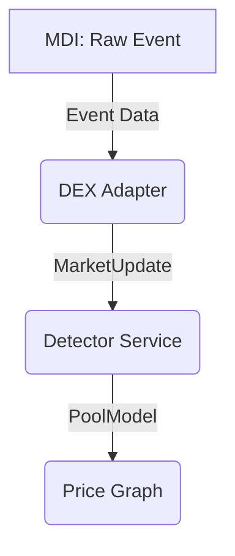

# DEX Adapter Architecture

## Guiding Principles

The `dex-adapters` crate serves as a translation layer between raw on-chain events and the standardized `MarketUpdate` format consumed by the `detector` service. Each adapter must adhere to the following principles:

1.  **Statelessness**: Adapters **must be stateless**. They should not maintain their own cache or state of pools (e.g., in a `DashMap`). The `detector`'s `PriceGraph` is the single source of truth for pool states.
2.  **Simplicity**: The sole responsibility of an adapter is to parse a raw `Event` and, if relevant, translate it into a `MarketUpdate`. It should not perform any other logic, such as price calculation, liquidity updates, or state management.
3.  **Canonical Types**: Adapters **must** use the canonical data structures defined in the `common` crate (e.g., `MarketUpdate`, `ClmmMarketUpdate`, etc.). They **must not** define their own parallel or duplicative types for pool state or events.

## Data Flow

The data flow is unidirectional and simple:



1.  The **Market Data Ingestor (MDI)** emits raw `Event` structs.
2.  A **DEX Adapter** receives an `Event`.
3.  The adapter attempts to deserialize the `event.data` into a DEX-specific event struct (e.g., `HyperionSwapEvent`).
4.  If deserialization is successful, the adapter populates a canonical `MarketUpdate` variant (e.g., `MarketUpdate::Clmm`) using the data from the event.
5.  The `MarketUpdate` is sent to the **Detector Service**, which then transforms it into a `PoolModel` and updates the `PriceGraph`.

## The `DexAdapter` Trait

The implementation of the `dex-adapter-trait::DexAdapter` should be straightforward:

```rust
#[async_trait]
pub trait DexAdapter: Send + Sync {
    /// Returns the unique identifier for the adapter (e.g., "hyperion").
    fn id(&self) -> &'static str;

    /// Parses a raw event and returns a `MarketUpdate` if the event is relevant.
    /// This function should be a pure, stateless transformation.
    fn parse_event(&self, event: &Event) -> Result<Option<MarketUpdate>>;
}
```

## Refactoring Summary

The existing implementation violates these principles by maintaining state and using non-canonical types. The refactoring will involve:

1.  Removing the `pools` `DashMap` and all state management logic from every adapter.
2.  Deleting the `crates/dex-adapters/src/types.rs` file entirely.
3.  Updating each adapter's `parse_event` function to be a simple, stateless parsing and translation function that directly produces a `common::types::MarketUpdate`.
4.  Defining local, minimal structs within each adapter file for deserializing the DEX-specific `event.data` payload.