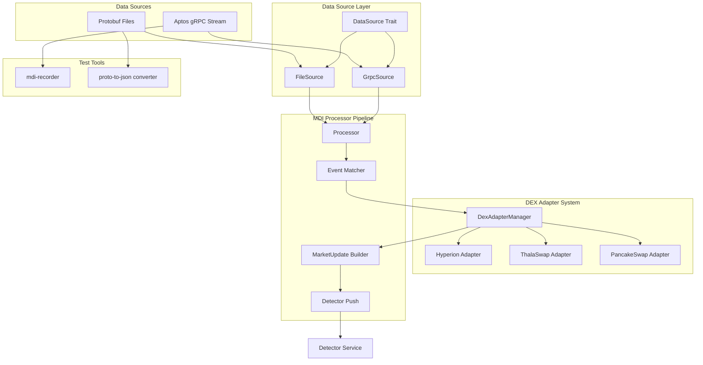

# Market Data Ingestor Architecture

## Overview

This document outlines the architecture for enhancing the Market Data Ingestor (MDI) service to meet the requirements of Issue #45. The design builds upon the existing functional codebase while adding support for configurable data sources, test data recording/replay, flexible market filtering, and a generic DEX adapter system.

## Requirements (Issue #45)

1. Connect to real live data from Aptos gRPC or feed pre-recorded test data (configurable)
2. Build a tool to create test data that matches the same format as live data
3. Filter for relevant market events based on configuration
4. Parse events using the appropriate DEX adapter
5. Publish `MarketUpdate` structs to the downstream channel for the Detector

## Architecture Overview



## Key Components

### 1. Data Source Abstraction

The `DataSource` trait abstracts the source of transaction data, allowing seamless switching between live gRPC streams and recorded test data.

```rust
#[async_trait]
pub trait DataSource: Send + Sync {
    async fn get_next_batch(&mut self) -> Result<TransactionBatch>;
}
```

**Implementations:**
- `GrpcSource`: Wraps the existing `TransactionStream` for live data
- `FileSource`: Reads pre-recorded protobuf files for testing

### 2. DEX Adapter System

Each DEX adapter encapsulates all protocol-specific logic for a particular exchange.

```rust
#[async_trait]
pub trait DexAdapter: Send + Sync {
    /// Returns list of module addresses this adapter monitors
    fn get_monitored_modules(&self) -> Vec<String>;
    
    /// Returns list of event types this adapter can parse
    fn get_event_types(&self) -> Vec<String>;
    
    /// Parse raw event data into MarketUpdate
    async fn parse_event(&mut self, event: Event) -> Result<Option<MarketUpdate>>;
    
    /// Get pools based on filter criteria
    fn get_relevant_pools(&self, filter: &PoolFilter) -> Vec<String>;
}

pub enum PoolFilter {
    /// All pools containing this token
    Token(String),
    /// Specific token pairs
    TokenPairs(Vec<(String, String)>),
    /// All pools
    All,
}
```

### 3. Test Data Recording

The `mdi-recorder` tool captures raw transaction data from the gRPC stream:

```protobuf
message RecordedBatch {
    uint64 start_version = 1;
    uint64 end_version = 2;
    int64 timestamp_ms = 3;
    repeated aptos.indexer.v1.Transaction transactions = 4;
}
```

Features:
- Preserves exact gRPC format for accurate replay
- Includes timing metadata
- Supports compression
- Provides converter tool for human-readable JSON export

### 4. Processing Pipeline

The simplified processing flow:

```rust
impl MarketDataIngestorProcessor {
    async fn process_transaction(&mut self, txn: Transaction) -> Result<()> {
        // 1. Extract all events from transaction
        let events = extract_events(txn);
        
        // 2. For each event, find matching adapter
        for event in events {
            if let Some(adapter) = self.adapter_manager.find_adapter(&event) {
                // 3. Parse event using adapter
                if let Some(update) = adapter.parse_event(event).await? {
                    // 4. Send to detector
                    self.update_sender.send(update).await?;
                }
            }
        }
        Ok(())
    }
}
```

## Configuration

```yaml
# Enhanced configuration structure
transaction_stream_config:
  starting_version: null
  indexer_grpc_data_service_address: "https://grpc.mainnet.aptoslabs.com:443"
  auth_token: "your_token_here"
  request_name_header: "market-data-ingestor"

market_data_config:
  # Data source configuration
  data_source:
    type: "grpc"  # or "file"
    file:
      path: "./recordings/mainnet_2024_01.pb"
      replay_speed: 1.0  # 1.0 = real-time, 0 = as fast as possible
  
  # Filter configuration
  filters:
    mode: "token_pairs"  # or "token" or "all"
    token_pairs:
      - ["APT", "USDC"]
      - ["APT", "USDT"]
    # OR for single token mode:
    # token: "APT"
  
  # DEX configurations with adapter settings
  dexs:
    - name: "Hyperion"
      module_address: "0x89576037b3cc0b89645ea393a47787bb348272c76d6941c574b053672b848039"
      pool_snapshot_event_name: "0x89576037b3cc0b89645ea393a47787bb348272c76d6941c574b053672b848039::pool::PoolSnapshot"
      swap_event_name: "0x89576037b3cc0b89645ea393a47787bb348272c76d6941c574b053672b848039::pool::SwapAfterEvent"
      settings:
        tick_spacing_threshold: 10
```

## Performance Considerations

To achieve sub-100ms processing latency:

1. **Event Pre-filtering**: Build Bloom filter at startup for O(1) event matching
2. **Parallel Processing**: Parse events concurrently across adapters
3. **Zero-copy Parsing**: Use references to avoid unnecessary allocations
4. **Memory Pooling**: Reuse buffers for event processing
5. **Batch Processing**: Process multiple events together when possible
6. **Metrics**: Add timing instrumentation to track performance

### Performance Budget (100ms total)
- Event extraction: 5ms
- Event matching: 5ms
- Adapter parsing: 20ms (parallel)
- Market update construction: 10ms
- Channel send: 5ms
- Buffer: 55ms

## Implementation Phases

### Phase 1: DEX Adapter Framework (Week 1)
1. Define `DexAdapter` trait
2. Refactor existing CLMM parser into `HyperionAdapter` and `ThalaSwapAdapter`
3. Create `DexAdapterManager` for adapter registration and lookup
4. Update configuration to support adapter-specific settings

### Phase 3: Test Tooling (Week 2)
1. Create `mdi-recorder` binary
2. Implement protobuf serialization for recordings
3. Add `proto-to-json` converter for debugging
4. Create sample test data files

### Phase 4: Filter System (Week 2)
1. Implement `PoolFilter` enum and matching logic
2. Add filter configuration to YAML
3. Update adapters to support dynamic pool discovery
4. Test multi-hop detection scenarios

## Migration Strategy

1. **Backward Compatibility**: Existing configurations continue to work
2. **Incremental Adoption**: New features can be enabled gradually
3. **Testing**: Each phase includes comprehensive tests before integration
4. **Documentation**: Update README and examples with each phase

## Future Considerations

- Support for additional DEX types (Order Book, etc.)
- Advanced filtering (volume thresholds, price ranges)
- Real-time configuration updates
- Horizontal scaling for high-throughput scenarios
- Integration with monitoring/alerting systems