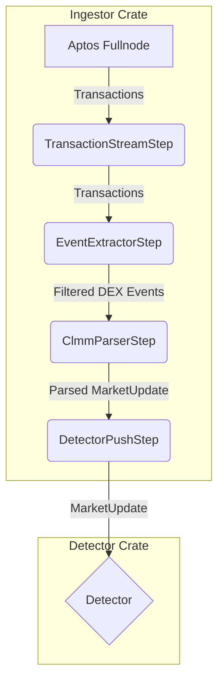

# Plan for Market Data Ingestor

This document outlines the plan to build a configurable, in-memory market data ingestor for Aptos DEXs.

## Core Requirements

1.  **No Database**: The processor will be entirely in-memory and will not write to any database.
2.  **Configurable**: The ingestor must be configurable to monitor specific DEXs, modules, events, and pools.
3.  **Direct Integration**: Parsed market data will be pushed directly to the `detector` crate via an in-memory channel.
4.  **CLMM Support**: The initial implementation will support Concentrated Liquidity Market Maker (CLMM) DEXs like Hyperion and ThalaSwap.

## Architecture

The ingestor will be built as a processing pipeline using the Aptos Indexer SDK.



### Pipeline Steps

1.  **`TransactionStreamStep`**: Fetches raw transactions from an Aptos fullnode. This is a standard component from the Indexer SDK.
2.  **`EventExtractorStep` (Custom)**: Filters the transaction stream, keeping only transactions that contain relevant events (e.g., `SwapAfterEvent`, `PoolSnapshot`) from the DEX modules specified in the configuration.
3.  **`ClmmParserStep` (Custom & Stateful)**: This is the core of the ingestor.
    *   **State Management**: It will maintain an in-memory `HashMap` to store the state (`sqrt_price`, `liquidity`, `tick_map`, etc.) for each monitored pool.
    *   **Initialization ("Snapshot")**: On startup, it will query the Aptos API (`GetEvents`) to fetch the latest `PoolSnapshot` for each configured pool to build its initial state.
    *   **Real-time Processing ("Stream")**: It will process incoming `SwapAfterEvent`s to update pool states in real-time. It will also use periodic `PoolSnapshot` events for reconciliation.
    *   **Transformation**: It will transform the internal pool state into the `PoolModel::ConcentratedLiquidity` struct required by the `detector`.
4.  **`DetectorPushStep` (Custom)**: Takes the final `MarketUpdate` and sends it over a `tokio::sync::mpsc::channel` to the `detector` crate.

## Configuration

The service will be configured via `config/default.yml`. The configuration will allow specifying a list of DEXs, each with its own parameters.

```yaml
market_data_ingestor:
  dexs:
    - name: "Hyperion"
      module_address: "0x..."
      pool_snapshot_event_name: "0x...::pool::PoolSnapshot"
      swap_event_name: "0x...::pool::SwapAfterEvent"
      pools:
        - "0x...pool_address_1"
        - "0x...pool_address_2"
    - name: "ThalaSwap"
      module_address: "0x1::thalaswap_v2::pool"
      pool_snapshot_event_name: "0x1::thalaswap_v2::pool::PoolSnapshot"
      swap_event_name: "0x1::thalaswap_v2::pool::SwapAfterEvent"
      pools:
        - "0x...pool_address_3"
```

## Integration

-   The `common` crate will define shared data structures like `MarketUpdate` and `PoolModel`.
-   The `detector` crate will be modified to accept the receiving end of the MPSC channel.
-   The main `arb-bot` binary will be responsible for creating the channel, initializing the `market-data-ingestor` and `detector` with their respective ends of the channel, and running both concurrently.
