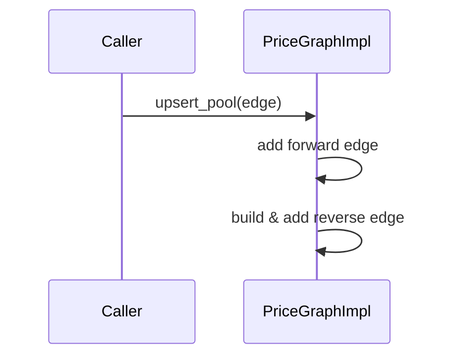

# ADR-032: Detector Refactor – Graph Management & Edge Handling

Date: 2025-06-16  
Status: Accepted  
Deciders: Detector team  
Issue: #32

## Context

The detector price graph models liquidity pools as directed edges between assets.  
Each real-world pool supports swaps in **both directions**, but our internal type
`Edge` represents a single **swap direction** (`asset_x -> asset_y`).  
The existing implementation of `PriceGraphImpl::upsert_edge` already inserts both
the provided edge and an automatically generated reverse edge with inverted pool
math. Issue #32 highlighted ambiguity in this contract and the removal of strict
asset validation in `Edge::quote`.

## Decision

1. **Pool insertion API**

   • Rename `upsert_edge` → `upsert_pool` to make the contract explicit:  
     one call represents one liquidity pool and results in *two* directed edges.  
   • Keep the current dual-insert logic, including model inversion for the
     reverse direction (reserve swap for CPMM, price inversion for CLMM).

2. **Asset validation**

   • Reinstate strict validation in `Edge::quote`.  
   • New signature  

     ```rust
     pub fn quote(&self, amount_in: &Quantity, asset_in: &Asset) -> Option<Quantity>
     ```  

   • The function returns `None` unless `asset_in == pair.asset_x`.

3. **Documentation**

   • Add doc block to `PriceGraph` trait describing the “pool → 2 edges” invariant.  
   • Update `docs/price_graph_design.md` accordingly.

## Consequences

* Clearer API prevents accidental single-direction inserts.  
* Call-sites must be renamed (`upsert_pool`) and provide `asset_in` when quoting.  
* Unit tests need mechanical updates; additional negative test ensures misuse is caught.

## Diagrams

### Pool insertion



### Quote validation

```mermaid
flowchart TD
  A[Caller supplies (amount, asset_in)] --> B{asset_in == pair.asset_x?}
  B -- Yes --> C[Run pool math] --> D[Quantity out]
  B -- No --> E[Return None]