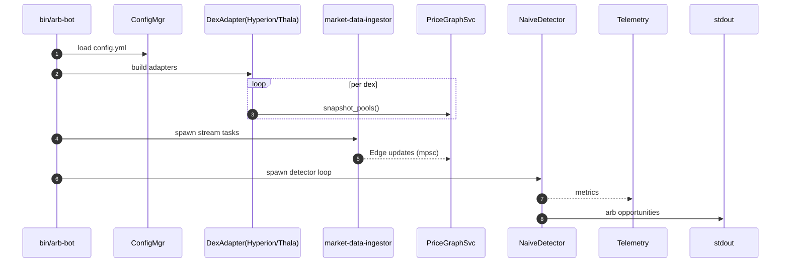

# Aptos Data Ingestion & Real-Time Arbitrage Detection – v2  
*Scope: APT/USDC & APT/USDT on Hyperion (CLMM) and Thala (CLMM)*  

---

## 0  Glossary  

| Term | Meaning |
|------|---------|
| **DEX adapter** | Crate implementing `dex_adapter_trait::DexAdapter` for one DEX |
| **CLMM pool** | Concentrated-liquidity market maker pool (Uniswap V3 style) |
| **Tick** | CLMM liquidity segment; price bucket |
| **PG** | `crates/detector::PriceGraphImpl` |
| **MDI** | `crates/market-data-ingestor` |
| **CFG** | Central runtime config (YAML) |

---

## 1  Repo vs Docs Gap  

| Area | Desired (docs) | Current repo |
|------|----------------|--------------|
| DEX adapters | Hyperion & Thala crates | trait only |
| Market-data ingestion | Aptos on-chain event/stream → PG | WebSocket skeleton |
| Config manager | `config/<env>.yml` | missing |
| Telemetry | `tracing` + Prometheus | basic `log` |
| Startup wiring | cfg → snapshot → subscribe | not wired |

Detector, price-graph, sizing & gas logic already match design.

---

## 2  System Flow  



---

## 3  Task Breakdown  

### 3.1 Configuration (`crates/core`)

| File | Purpose |
|------|---------|
| `config/default.yml` | initial config (DEX list, RPC / indexer URLs, pairs, intervals) |
| `config.rs` | `#[derive(Deserialize)] BotConfig` loader |

```yaml
dexes:
  - name: hyperion          # CLMM
    module_addr: "0xHYP"
    grpc_indexer: "https://indexer.mainnet.aptoslabs.com:50051" # Or your preferred indexer
    fullnode_rpc: "https://fullnode.mainnet.aptoslabs.com"
    pairs: ["APT/USDC","APT/USDT"]
  - name: thala
    module_addr: "0xTHL"
    grpc_indexer: "https://indexer.mainnet.aptoslabs.com:50051" # Or your preferred indexer
    fullnode_rpc: "https://fullnode.mainnet.aptoslabs.com"
    pairs: ["APT/USDC","APT/USDT"]
detector:
  interval_ms: 500
  min_profit_pct: 0.01
```

### 3.2 DEX Adapters  

| Crate | Key APIs / Details |
|-------|--------------------|
| `crates/adapters/hyperion` | **CLMM**<br>• **Snapshot**: latest `PoolSnapshot` event per pool via **`GetEvents`** (fallback `GetAccountResources`) to obtain `sqrt_price`, `liquidity`, `tick`, `fee_rate` and build the initial tick map.<br>• **Stream**: subscribe to `SwapAfterEvent` for real-time price / tick / liquidity updates; also listen to periodic `PoolSnapshot` for reconciliation and use `SwapEvent` only for volume & fee metrics.<br>• Build `PoolModel::ConcentratedLiquidity { ticks, fee_bps }` → two `Edge`s. |
| `crates/adapters/thala` | **CLMM**<br>• **Snapshot**: latest `PoolSnapshot` event per pool via gRPC `GetEvents` (from `0x1::thalaswap_v2::pool`) to obtain `sqrt_price`, `liquidity`, `tick`, `fee_rate`, `tick_spacing`.<br>• **Stream**: subscribe to `SwapAfterEvent` for real-time updates; reconcile with periodic `PoolSnapshot`.<br>• Build `PoolModel::ConcentratedLiquidity { ticks, fee_bps }` → two `Edge`s. |
| Shared adapter trait | ```rust
pub trait DexAdapter {
    async fn snapshot_pools(&self) -> Result<Vec<Edge>>;
    async fn start_stream(self, sender: mpsc::Sender<PoolUpdate>) -> Result<()>;
}
``` |

### 3.3 Market-Data Ingestor (MDI)

1. `AptosGrpcIngestor { client: IndexerGrpcClient, cursor_version: u64 }`
2. For each adapter, spawn `tokio::task` that:<br>  • calls `snapshot_pools` once → PG<br>  • subscribes via `StreamTransactions` with event/resource filters<br>  • on each update, pushes `PoolUpdate` through channel.

Fallback: if `grpc_indexer` unset, use REST polling with `/v1/transactions?start=<cursor>`.

### 3.4 PriceGraph Service

Unchanged; channel consumer calls `upsert_pool`.

### 3.5 Detector Enhancements

* `allowed_pairs` filter from config.  
* Leave CLMM maths as implemented in `Edge::quote`.

### 3.6 Telemetry

Metrics exported on `:9000/metrics`:

| Metric | Type | Source |
|--------|------|--------|
| `hyperion_ticks_total` | counter | adapter stream |
| `thala_ticks_total` | counter | adapter stream |
| `edges_active` | gauge | PG |
| `arb_opportunities_total` | counter | detector |

### 3.7 Startup Sequence

```rust
let cfg = ConfigMgr::load(path)?;
let (pg_tx, pg_rx) = mpsc::channel(10_000);
for dex_cfg in cfg.dexes {
    let adapter = AdapterFactory::create(dex_cfg).await?;
    adapter.snapshot_pools().await?.into_iter().for_each(|e| pg_tx.send(e));
    tokio::spawn(adapter.start_stream(pg_tx.clone()));
}
PriceGraphService::start(pg_rx);
Detector::start(cfg.detector, price_graph_handle, telemetry);
```

### 3.8 CLI Flags

`--config`, `--log-level`, `--once`.

### 3.9 Testing

* Unit: BCS decoding of `LiquidityPool` resource.  
* Integration: spin local indexer (docker), deploy mock Hyperion pool, verify updates reach PG.

### 3.10 Milestones

| M# | Duration | Deliverable |
|----|----------|-------------|
| M1 | 1 day | Config manager |
| M2 | 2 days | Hyperion adapter (snapshot + stream) |
| M3 | 2 days | Thala adapter |
| M4 | 1 day | MDI wiring + PG updates |
| M5 | 1 day | Telemetry + CLI |
| M6 | 1 day | Docs & runbook |

---

## 4  Implementation Notes

1. **Hyperion CLMM decoding**  
   * `LiquidityPool { current_tick: i32, sqrt_price: u128, fee_bps: u16, tick_bitmap: vector<u8> ... }`  
   * Build `Vec<Tick>` by scanning bitmap; each tick holds `price`, `liquidity_gross`.  

2. **Real-time feed priority**  
   1. gRPC `StreamTransactions` (push)  
   2. full-node SSE `/v1/stream/batch` (push)  
   3. REST polling (fallback)

3. **Safety**  
   * On adapter reconnect, resume from `cursor_version + 1`.  
   * Detector runs only on PG snapshots ≤ 100 ms old.

4. **Gas price refresh** via existing `GasCalculator::fetch_current_gas_price`.

---

## 5  Runbook

```bash
# build
cargo build --release
# run with local grpc indexer
RUST_LOG=info ./target/release/arb-bot --config config/default.yml
# metrics
curl http://localhost:9000/metrics
```

---

## 6  Phase-2: No-Loss Guard

* Pre-trade on-chain `view_function` for each swap.  
* Abort if `net_profit < 0` after gas.

---

## 7  Future Extensions

* Multi-hop detection  
* Tapp  
* Threshold signing (HSM)  
* External USD oracle for cross-asset PnL

---

_End of plan v2 – follow exactly; Hyperion treated as CLMM with gRPC streaming source._
