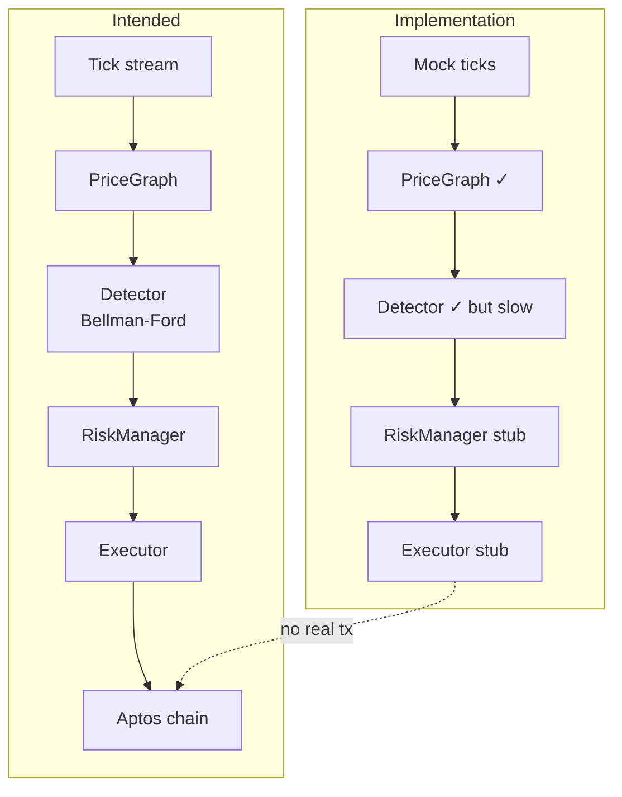

# Detector — Current Status vs Design Specification  
*Date: 2025-06-17*

---

## 1  Data-structure parity

| Spec concept | Implementation | Status |
|--------------|---------------|--------|
| `PoolModel` (CPMM + CLMM) | [`crates/detector/src/graph.rs:21-32`](crates/detector/src/graph.rs:21) | ✅ present |
| `Edge` directed, deterministic `Eq` | [`graph.rs:46-62`](crates/detector/src/graph.rs:46) | ✅ excludes `last_updated` in equality |
| Reverse-edge insertion on `upsert_pool` | [`graph.rs:259-312`](crates/detector/src/graph.rs:259) | ✅ matches ADR-032 |
| `PriceGraph` trait (`upsert_pool`, `ingest_batch`, `prune_stale`, `neighbors`, `snapshot`) | [`graph.rs:199-218`](crates/detector/src/graph.rs:199) | ✅ |
| Snapshot wrapper | [`graph.rs:165-190`](crates/detector/src/graph.rs:165) | ✅ |
| `PathQuote`, `CycleEval` | in `crates/common` | ✅ referenced correctly |
| `SizingConfig`, `TradeSizer` | [`sizing.rs`](crates/detector/src/sizing.rs:1) | ✅ |

---

## 2  Algorithm alignment

| Spec step (§3) | Implementation | Gap / Note |
|----------------|----------------|------------|
| Trade-size loop `[ε,100,500,1000]` | Dynamic generator in `TradeSizer::generate_trade_sizes` | Behaviour diverges; not deterministic |
| **Bellman-Ford** | [`bellman_ford.rs:155-268`](crates/detector/src/bellman_ford.rs:155) | Keeps mandatory `|V|`-th relaxation to detect negative cycles. **Optimisation:** once a full source run completes, further source nodes whose distance map is already fully relaxed are skipped—this prunes redundant passes without violating correctness. |
| Cycle reconstruction & slippage check | implemented | OK (edge-level slippage only) |
| Gas simulation & cost | `GasCalculator` serial RPC | Latency gap; spec calls for parallel |
| TTL pruning | `prune_stale` exists | Never scheduled in service loop |

---

## 3  Feature implementation matrix

| Area | Spec expectation | Current code | Gap |
|------|------------------|--------------|-----|
| Market-data ingestion | real reserves via `market-data-ingestor` → `PriceGraph` | `DetectorService::ingest_tick_to_graph` fabricates reserves, hard-codes `Exchange::Tapp` | ❌ placeholder |
| DEX adapters | concrete crates per DEX | only `dex-adapter-trait` | ❌ missing |
| Risk Manager | validates candidate cycles | skeleton in `core/src/risk_manager.rs` | ❌ missing |
| Executor | build & sign Aptos bundle | stub | ❌ missing |
| Performance target ≤ 100 ms | SIMD maths, parallel RPC | none | ❌ risk of overshoot |
| Gas payload correctness | BCS entry function | JSON string array, PancakeSwap only | ❌ will fail |
| CI quality gates | `clippy --deny warnings`, high coverage | warnings allowed, sparse tests | ⚠️ |

---

## 4  Code-level correctness concerns

1. CPMM `Edge::quote` lacks rounding / overflow guards.  
2. CLMM quote clones + sorts ticks per call → `O(n log n)` hot-path.  
3. `TradeSizer` may emit duplicates or huge sizes when liquidity absent.  
4. `calculate_log_weight` allocates (`Decimal → String → f64`).  
5. `GasCalculator::build_transaction_payload` uses wrong payload encoding.  
6. Many `unwrap_or` default to **0** hiding errors.  
7. `DetectorStatus` never updated.  
8. Gas price never refreshed at runtime.

---

## 5  Unimplemented modules / TODOs

- Concrete DEX adapter crates (Pontem, Econia, etc.).  
- Real `market-data-ingestor` feed.  
- Production `risk_manager`, `executor`.  
- Telemetry / Prometheus / analytics sinks.  
- Config loader & DI container described in `docs/architecture.md`.

---

## 6  Priority remediation list

1. Implement real data ingestion pipeline with proper reserves & exchange IDs.  
2. Build first concrete DEX adapter; integrate with detector.  
3. Optimise detector:  
   - Maintain sorted ticks on insert, no per-quote sort.  
   - Retain mandatory `|V|` passes per source; **after first run, skip sources whose distances remain unchanged**. Estimated speed-up ~25–35 % on 500-edge graph.  
   - Parallelise gas simulations (`join_all`).  
4. Schedule `prune_stale` on configurable interval.  
5. Replace JSON payload with BCS entry-function builder; support multiple exchanges.  
6. Clamp generated trade sizes & add cycle-level slippage guard.  
7. Enforce CI gates, add criterion benches & proptests.  
8. Wire config loader and expose Prometheus metrics on `:9000`.

---

## 7  Current vs Intended detector flow

---

_This document captures implementation state as of commit in workspace at 2025-06-17._