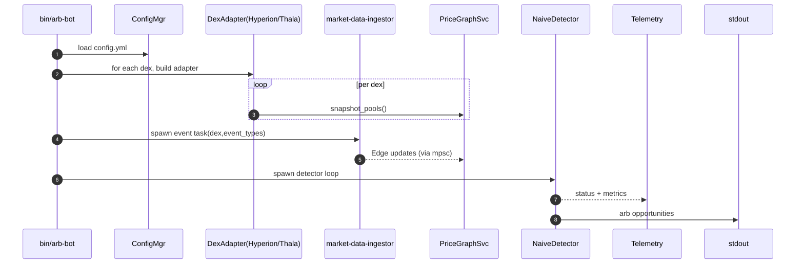

# Aptos Data Ingestion & Real-Time Arbitrage Detection  
*Target scope: APT/USDC & APT/USDT on Hyperion and Thala DEXes*

---

## 0  Glossary  
| Term | Meaning |
|------|---------|
| **DEX adapter** | Thin crate implementing `dex_adapter_trait::DexAdapter` for one DEX |
| **Pool** | On-chain liquidity resource (constant-product or CLMM) |
| **Tick** | CLMM liquidity segment on Thala |
| **PG** | `crates/detector::PriceGraphImpl` |
| **MDI** | `crates/market-data-ingestor` |
| **CFG** | Centralised runtime config (YAML) |

---

## 1  Current Code vs Docs Gap

| Area | Docs (desired) | Repository |
|------|----------------|------------|
| DEX adapters | Plug-in crates per DEX | Trait crate only; no Hyperion/Thala impls |
| Market-data ingestion | Aptos on-chain event stream → PG | Generic WebSocket skeleton |
| Config manager | `config/<env>.yml` to select pairs/DEXes | Missing |
| Telemetry | `tracing`+Prometheus | Only basic `log` |
| Risk / Executor | Stubs only | Same |
| Startup flow | ① load cfg ② snapshot pools ③ subscribe events | Not wired |

Detector, price-graph, sizing, gas & tests are present and align with docs.  
Thus **missing work is entirely around data ingestion, configuration and wiring**.

---

## 2  High-Level Flow (new)  



---

## 3  Concrete Tasks & File-level Plan

### 3.1 Configuration (crates/core)

| File | Description |
|------|-------------|
| `crates/core/src/config.rs` | `#[derive(Deserialize)] BotConfig` (DEXes, pairs, RPCs, min_profit) |
| `config/default.yml` | ```yaml
dexes:
  - name: hyperion
    rpc: "https://fullnode.mainnet.aptoslabs.com"
    pairs: ["APT/USDC","APT/USDT"]
  - name: thala
    rpc: "https://fullnode.mainnet.aptoslabs.com"
    pairs: ["APT/USDC","APT/USDT"]
detector:
  interval_ms: 500
  min_profit_pct: 0.01
``` |
| Loader | `fn load(path) -> Result<BotConfig>` using `serde_yaml` |

### 3.2 DEX Adapter Implementations

| Crate | Key APIs to implement |
|-------|-----------------------|
| `crates/adapters/hyperion` | `fn fetch_pools(&self) -> Vec<Edge>` using `view_function` on modules:<br/>`0x1::dex::LiquidityPool` (constant-product) |
| `crates/adapters/thala` | For CLMM:<br/>• walk `LiquidityPoolRegistry` → pair IDs<br/>• read `Pool` resource incl. tick bitmap → build `PoolModel::ConcentratedLiquidity` |
| Shared | • `fn subscribe_events(&self, sender: mpsc::Sender<PoolUpdate>)`<br/>   where `PoolUpdate` = `Edge` replacement<br/>• Use Aptos `stream` / `transactions/by_height` polling every block if WebSocket not available |

### 3.3 Market-Data Ingestor Wiring

1. Replace skeleton `WebSocketIngestor` with **Aptos event poller**:  
   ```rust
   pub struct AptosPollIngestor { client: aptos_sdk::Client, last_version: u64 }
   ```
2. Produce `Vec<Edge>` on every pool-change event → send via channel to PG.
3. MDI handles multiple DEX adapters with `FuturesUnordered`.

### 3.4 PriceGraph Service (minor)

* Already exposes `upsert_pool`; ensure channel consumer in `service.rs` uses it.

### 3.5 Detector Filters

* Add `DetectorConfig.allowed_pairs: HashSet<(Asset,Asset)>`  
* Filter cycles not starting & ending in allowed assets.

### 3.6 Telemetry

| Metric | Type | Source |
|--------|------|--------|
| ticks_ingested_total | counter | PG channel consumer |
| edges_active | gauge | PG snapshot |
| detector_runs_total | counter | detector loop |
| arb_opportunities_total | counter | detector positive cycles |

Expose with `tracing_subscriber/prometheus` on `:9000/metrics`.

### 3.7 Startup Sequence (bin/arb-bot)

1. `let cfg = ConfigMgr::load(path)`  
2. Build adapters (`Arc<dyn DexAdapter>`)  
3. Snapshot pools → PG  
4. Spawn MDI tasks (`tokio::spawn`)  
5. Start detector loop every `cfg.detector.interval_ms`  
6. Run HTTP metrics exporter (optional)  
7. Wait on `ctrl_c` for graceful shutdown

### 3.8 CLI Flags (structopt/clap)

* `--config <file>` override  
* `--log-level`  
* `--once` (run detector once then exit)

### 3.9 Unit & Integration Tests

* Mock Aptos client returning sample pool resources → verify `Edge` translation.  
* Golden file with Hyperion pool JSON.  
* Integration: fork‐devnet, deploy minimal pool, run adapter snapshot.

### 3.10 Milestones

| Milestone | Deliverables |
|-----------|--------------|
| M1 setup (⩽1 day) | Config manager + YAML + load verified |
| M2 adapters (⩽3 days) | Hyperion + Thala snapshot + basic event poll |
| M3 wiring (⩽2 days) | Channels, PG updates, detector filtering |
| M4 telemetry (⩽1 day) | Prometheus exporter + basic Grafana dashboard |
| M5 docs & polish (⩽1 day) | README update, add runbook |

---

## 4  Implementation Notes

1. **Initial price snapshot**: call `DexAdapter::fetch_pools`; each pool converted to `Edge` (forward+reverse) then pushed into PG before detector spawn.  
2. **Real-time feed**: lacking native Aptos WebSocket, poll every block (≈1 s) using `get_transactions?start=<v>`; keep cursor per adapter.  
3. **Fee handling**: Hyperion fee 30 bps; Thala CLMM variable but included in pool resource → ensure `Edge::fee_bps`.  
4. **Decimals**: Thala pools use `u64` fixed-point 1e6; convert to `Decimal`.  
5. **Gas price**: continue using `GasCalculator::fetch_current_gas_price` every minute.

---

## 5  Runbook (for less-experienced dev)

```bash
# 1. Prerequisites
rustup install stable
apt-get install -y protobuf-compiler # aptos-sdk build

# 2. Clone & build
git clone git@github.com:org/aptos-arb-bot.git
cd aptos-arb-bot
cargo build --release

# 3. Configure
cp config/default.yml config/prod.yml
# edit RPC endpoints if needed

# 4. Run
RUST_LOG=info ./target/release/arb-bot --config config/prod.yml
# metrics → http://localhost:9000/metrics

# 5. Observe stdout:
[INFO] detector: profitable cycle APT→USDC→APT profit=0.08 APT (0.12%)
```

---

## 6  “No-Loss” Safety Guards (phase-2)

* Before `execute_trade`, run `view_function` on each swap with current reserves to ensure expected output ±ϵ.  
* Abort if `net_profit < 0` after gas adjustment.  
* Add `cfg.detector.min_profit_pct` (already planned).

---

## 7  Future Work (out-of-scope)

* Multi-hop (>2 pools)  
* Additional DEXes (Econia, Aries)  
* Threshold signing & key management  
* Off-chain oracle for USD conversion

---

_End of plan – implement exactly as specified; avoid ad-hoc design changes._
