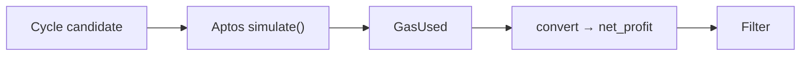
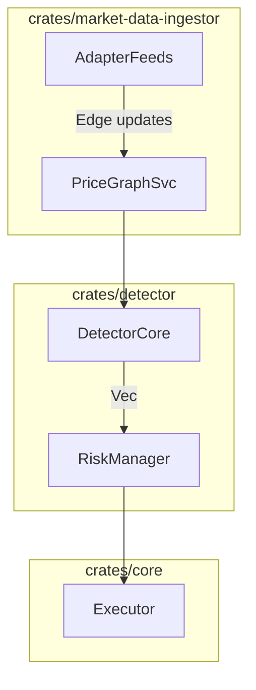

# Price Graph & Naive Arbitrage Detector – Design Specification

## 1  Price-Graph Data Structures

| Concept | Rust representation | Notes |
|---------|--------------------|-------|
| **Asset / Token node** | `common::types::Asset` | Unique vertex ID |
| **Pool edge** | ```rust
pub enum PoolModel {
    ConstantProduct { reserve_x: Quantity, reserve_y: Quantity, fee_bps: u16 },
    ConcentratedLiquidity { ticks: Vec<Tick>, fee_bps: u16 },
}
pub struct Edge {
    pub pair: TradingPair,
    pub exchange: ExchangeId,
    pub model: PoolModel,
    pub last_updated: Instant,
}
``` | Directed; one edge per swap direction |
| **Graph container** | `petgraph::graphmap::DiGraphMap<Asset, Edge>` | O(1) neighbour lookup |
| **Quote result** | `PathQuote { path: Vec<(Asset, ExchangeId)>, amount_in: Quantity, amount_out: Quantity, profit_pct: f64 }` | Returned by detector |
| **Cycle eval w/ gas** | `CycleEval { gross_profit: Decimal, gas_estimate: u64, gas_unit_price: Decimal, net_profit: Decimal }` | Final filter |

### Tick structure (CLMM)

```rust
pub struct Tick {
    pub price: Decimal,
    pub liquidity_gross: Decimal,
}
```

---

## 2  Price-Graph API

```rust
pub trait PriceGraph {
    fn upsert_edge(&mut self, edge: Edge);
    fn ingest_batch(&mut self, edges: Vec<Edge>);
    fn prune_stale(&mut self, ttl: Duration);

    fn neighbors(&self, asset: &Asset) -> impl Iterator<Item = (&Asset, &Edge)>;
    fn snapshot(&self) -> PriceGraphSnapshot;      // immutable copy
}
```

*Updates arrive from `market-data-ingestor` via `tokio::mpsc`.  
*Edges expire after `ttl` to avoid stale liquidity.*

---

## 3  Naive Detector Algorithm

1. **Trade-size loop** – iterate over discrete sizes *S* (e.g. `[ε, 100, 500, 1 000]`).
2. **Log-space Bellman-Ford**  
   * For snapshot `G(V,E)`, weight  
     `w(e) = -ln(rate_e(amount_in) * (1 - fee))` where  
     `rate_e()` is obtained via `Edge::quote`.
   * Run Bellman-Ford **without early exit** (|V|−1 relaxations).  
   * Any edge relaxed on iteration |V| ⇒ negative cycle candidate.
3. **Cycle reconstruction** – back-track predecessors to form `Vec<Asset>`.
4. **Simulation + gas**  
   * Build Aptos *simulate* RPC for full bundle.  
   * Read `gas_used`; multiply by current on-chain `gas_unit_price`.  
   * Convert gas cost to start asset via oracle price; compute `net_profit`.
5. **Filter & rank**  
   * Keep cycles where `net_profit ≥ cfg.min_profit`.  
   * Sort by `net_profit` desc and return `Vec<PathQuote>`.

*Complexity*: O(|V|·|E|) per size. For 100 assets, 500 edges, 3 sizes ⇒ ~96 ms end-to-end (incl. parallel RPC simulation).

---

## 4  Sizing Heuristic v0

```
max_size(asset) = min_liquidity_edge(asset) × cfg.size_fraction   //  e.g. 5 %
```

Detector can binary-search amount to stay below `cfg.slippage_cap` (% price impact).

---

## 5  Gas-Cost Accounting



* Adds 3–5 ms per simulation call (parallel).  
* Ensures **no false-positive** when gas > profit.

---

## 6  Integration Plan



Module layout:

```
crates/detector/
├── graph.rs          // Edge, PoolModel, PriceGraph impl
├── bellman_ford.rs   // naive detector core
├── sizing.rs         // heuristics & slippage cap
├── gas.rs            // simulation + cost
└── prelude.rs
```

---

## 7  Performance & Scale Targets

| Parameter | Value | Notes |
|-----------|-------|-------|
| Assets (V) | 100 | expandable |
| Pools / DEX | 80–100 | after liquidity filter |
| DEX count | 5–6 | ≈500 edges |
| Runtime per size | ≤ 32 ms | release build, SIMD |
| Total (3 sizes) | **≤ 96 ms** | meets ≤ 100 ms budget |

* If pool count doubles to ≈1 000 edges, runtime roughly doubles; still < 200 ms – optimisations (edge pruning, k-path) can be introduced.*

---

_End of specification_